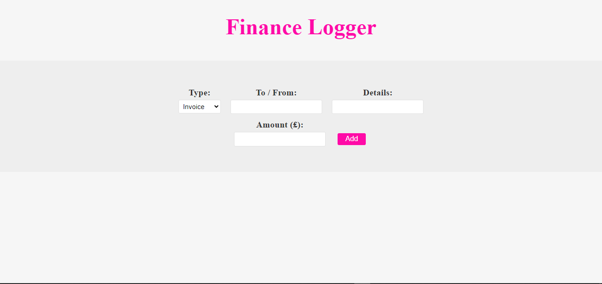

# finance-logger

This Finance Logger Web App is a simple and efficient tool for logging financial transactions, built using TypeScript and Vite. It allows users to record and manage invoices and payments, along with relevant details like the client's name, transaction details, and amount. The app features a user-friendly interface to add new entries.

## Features

- **Transaction Type**: Select between invoice or payment.
- **To/From**: Enter the name of the client involved in the transaction.
- **Details**: Provide a description of what the money was used for.
- **Amount**: Enter the transaction amount.
- **Add Button**: Add the transaction to the log.
- **Transaction List**: View the list of all recorded transactions, rendered dynamically.

## Demo



https://hallowdread.github.io/finance-logger/

## Installation

To get started with the Finance Logger Web App, follow these steps:

1. **Clone the repository:**

   ```bash
   git clone https://github.com/your-username/finance-logger.git
   cd finance-logger
   ```

2. **Install dependencies:**

   ```bash
   npm install
   ```

3. **Start the development server:**

   ```bash
   npm run dev
   ```

4. **Build the project for production:**

   ```bash
   npm run build
   ```

5. **Preview the production build:**
   ```bash
   npm run preview
   ```

## Usage

1. Open the app in your browser.
2. Fill in the transaction details:
   a. Type: Select either "Invoice" or "Payment".
   b. To/From: Enter the client's name.
   c. Details: Provide a brief description of the transaction.
   d. Amount: Enter the transaction amount.
3. Click the Add button to log the transaction.
4. View the list of transactions rendered below the input form.

## Project Structure

Here's an overview of the project structure:

```arduino
finance-logger/
├── node_modules/
├── public/
│   └── vite.svg
├── src/
│   ├── main.ts
│   ├── style.css
│   ├── vite.env.d.ts
│   ├── classes/
│   │   ├── invoice.ts
│   │   ├── list-template.ts
│   │   ├── payment.ts
│   └──  interfaces/
│       └── hasFormater.ts
│
├── .gitignore
├── index.html
├── package-lock.json
├── package.json
├── README.md
└── tsconfig.json
```

## Technologies Used

1. TypeScript: A strongly typed programming language that builds on JavaScript.
2. Vite: A fast build tool and development server for modern web projects.

## Contributing

Contributions are welcome! Please open an issue or submit a pull request for any bug fixes or enhancements.
